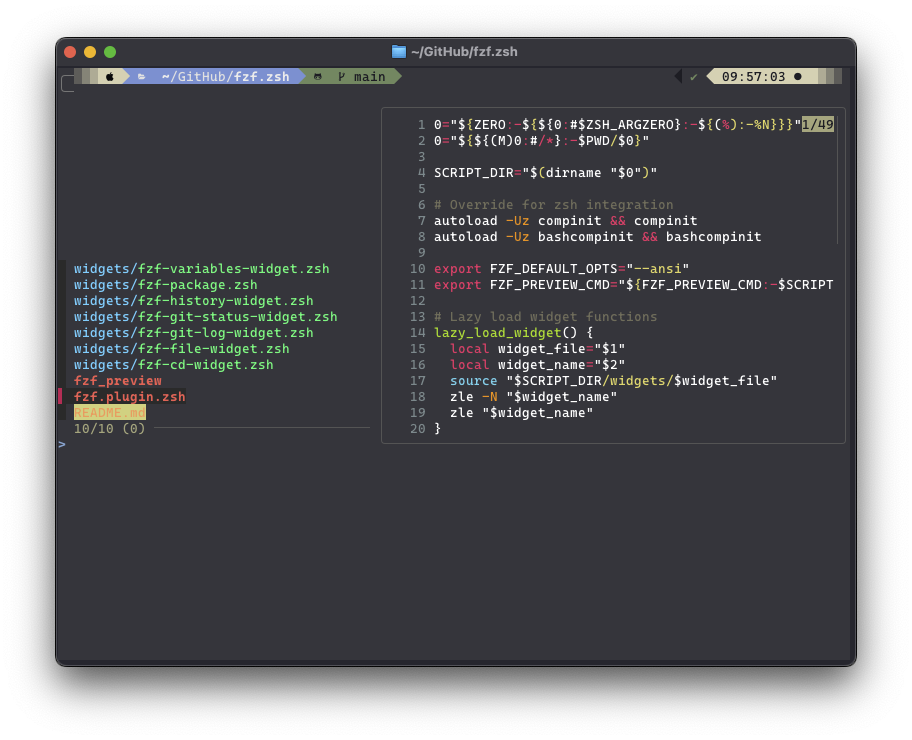
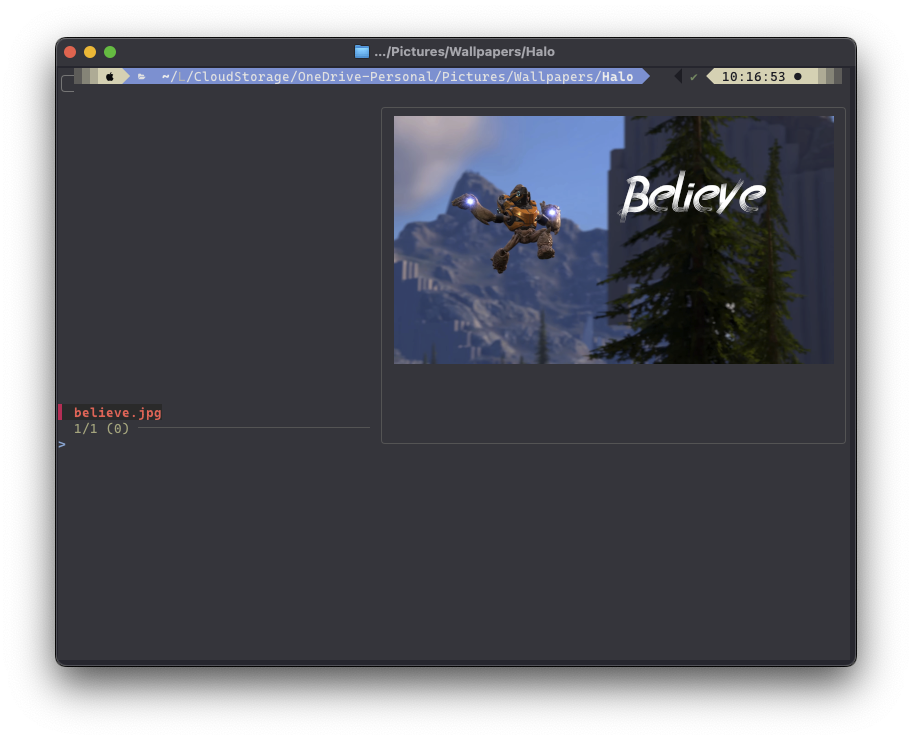
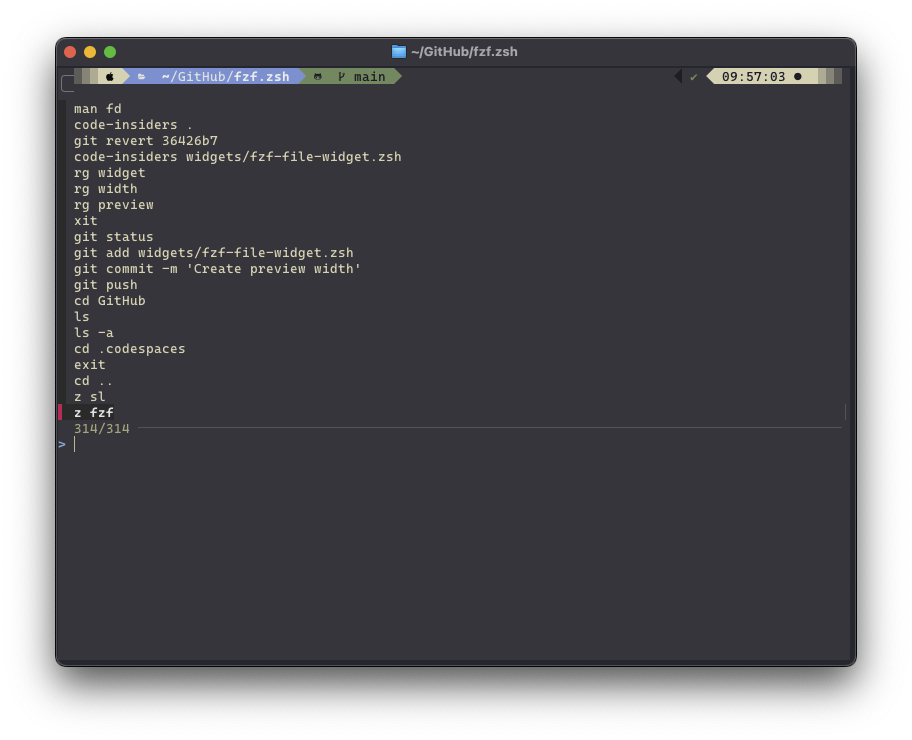
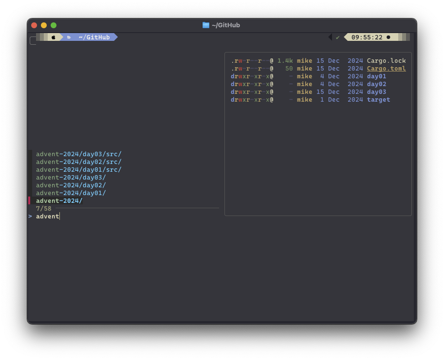
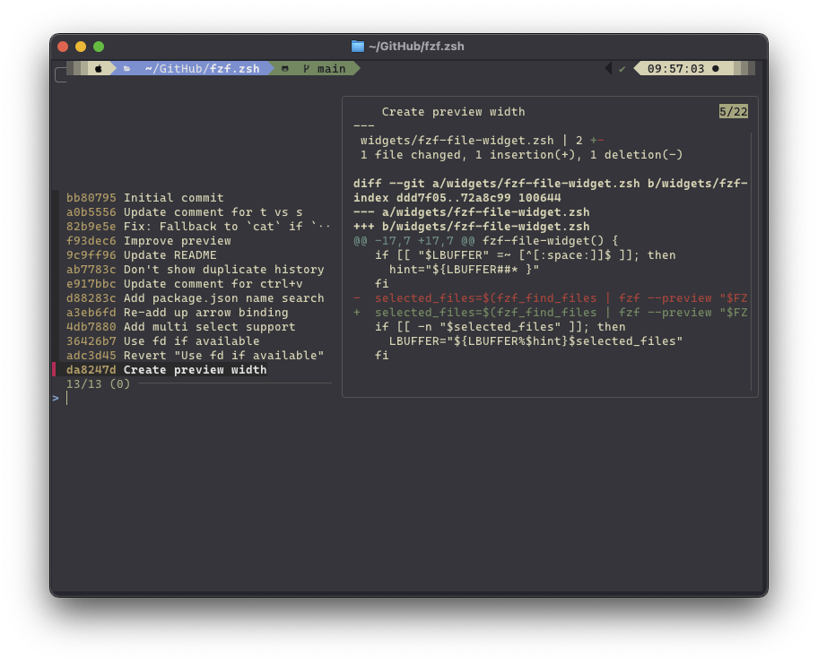
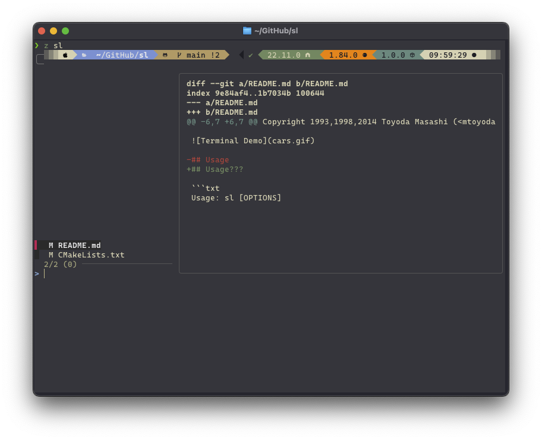
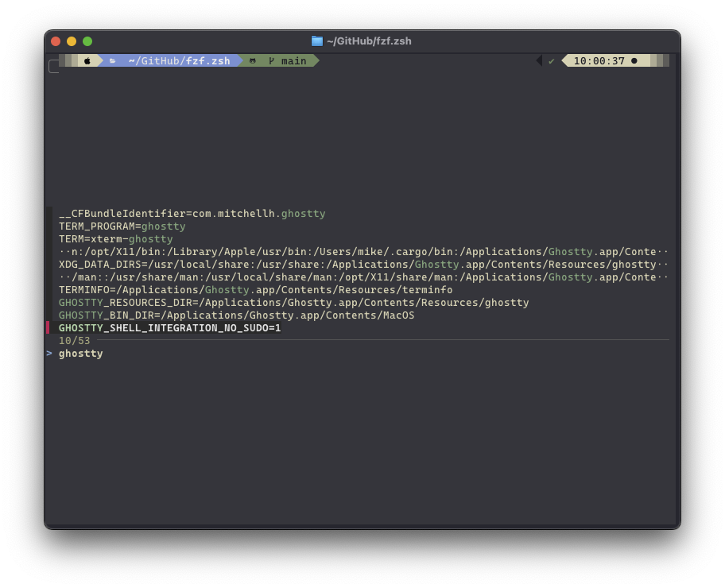
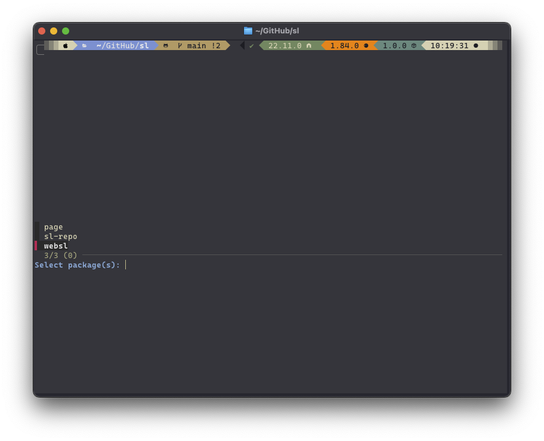

# FZF ZSH Plugin

This is a plugin for zsh heavily inspired by [PatrickF1/fzf.fish](https://github.com/PatrickF1/fzf.fish).

It's still a work in progress, and has slightly different keybindings.

## Keybindings

For git status to work with `Ctrl+Alt+S`, make sure to disable `ixon` in your `.zshrc`:

```zsh
if [[ $- == *i* ]]; then
  stty -ixon < /dev/tty
fi
```

| Keybinding   | Description                            |
| ------------ | -------------------------------------- |
| `Ctrl+Alt+F` | File search using fzf                  |
| `Ctrl+R`     | History search using fzf               |
| `Alt+c`      | Change directory using fzf             |
| `Ctrl+Alt+L` | Git log search using fzf               |
| `Ctrl+Alt+S` | Git status search using fzf            |
| `Ctrl+V`     | Environment variables search using fzf |
| `Ctrl+Alt+W` | Find a package name using fzf          |
| `Ctrl+Alt+B` | Blame search                           |

## Installation

### Antidote

```sh
antidote install scaryrawr/fzf.zsh
```

### Oh My Zsh

```sh
git clone https://github.com/scaryrawr/fzf.zsh $ZSH_CUSTOM/plugins/fzf
```

## Screenshots

### File Search





### History Search



### Change Directory



### Git Log Search



### Git Status Search



### Environment Variables Search



### Find a Package Name



## Dependencies

### Required

- [fzf](https://github.com/junegunn/fzf)

### Optional

- [chafa](https://github.com/hpjansson/chafa) - Image preview
- [bat](https://github.com/sharkdp/bat) - cat with syntax highlighting
- [fd](https://github.com/sharkdp/fd) - Alternative to `find`
- [eza](https://github.com/eza-community/eza) - Alternative to `ls`

## Customizable Variables

You can customize the behavior of the fzf plugin by setting the following environment variables:

| Variable Name                | Description                           | Passed Argument |
| ---------------------------- | ------------------------------------- | --------------- |
| `FZF_DEFAULT_OPTS`           | Default options for fzf               | N/A             |
| `FZF_PREVIEW_CMD`            | Command to use for file preview       | file path       |
| `FZF_GIT_BLAME_PREVIEW_CMD`  | Command to use for git blame preview  | file path       |
| `FZF_GIT_COMMIT_PREVIEW_CMD` | Command to use for git commit preview | commit          |
| `FZF_GIT_LOG_PREVIEW_CMD`    | Command to use for git log preview    | commit          |
| `FZF_DIFF_PREVIEW_CMD`       | Command to use for diff preview       | diff            |
